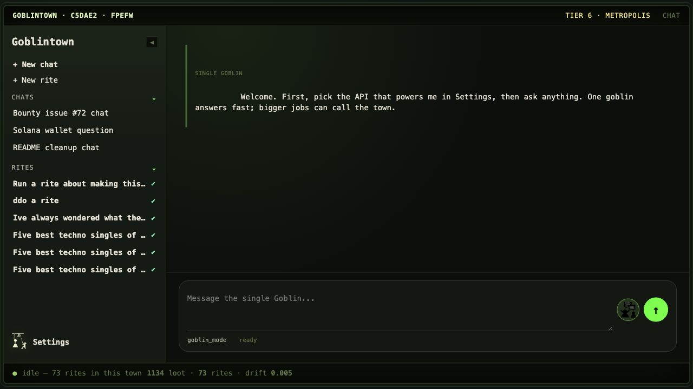
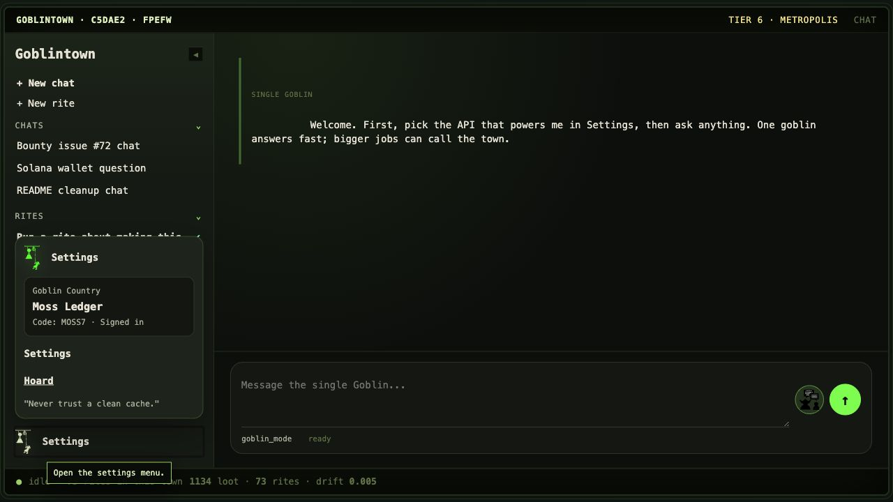
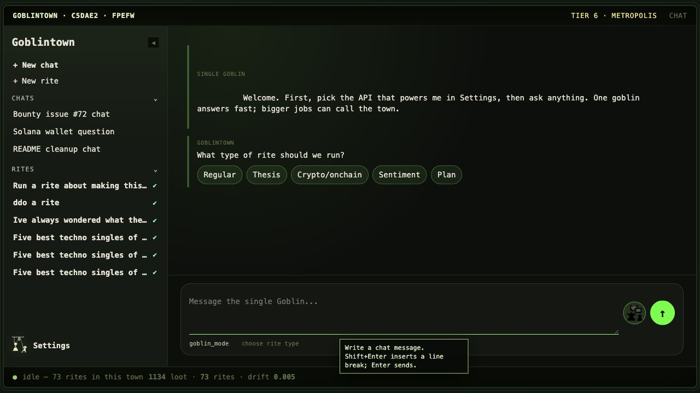

<p align="center">
  
</p>

# Goblintown

Goblintown is a local-first AI workbench for asking one model a question, or
for handing the same question to a small, opinionated town of specialized
agents that remember, argue, attack, review, recover, and write down what
survived.

It is not a chatbot skin. It is a file-backed orchestration protocol with a
desktop shell, a browser UI, a CLI, resumable runs, typed memory, provider
routing, local add-ons, and a strange amount of ceremony for something that
still starts with a text box.

The short version:

- **Single Goblin** is one worker, one answer, one fast model call.
- **Goblintown mode** is the full Rite: context scavenging, a pack of Goblins,
  adversarial Gremlin critique, Troll review, Specialist recovery, Ogre
  fallback, and Pigeon-Scribe memory.
- **The Hoard** is the local append-only record of Loot, Rites, Artifacts,
  runs, inboxes, and outboxes.
- **Skills and extensions** are written down as operational rituals: tool
  packs, provider routes, reward plugins, and repo skills that tell future
  agents how to add real capabilities without smearing glue everywhere.

Current beta release line: `0.7.0-beta.1`.

## Screenshots

The app opens into the single-Goblin chat shell. The left rail keeps chats and
Rites nearby; the bottom composer can stay as one model call or hand the work to
the town.



Settings are intentionally close, because the first hard question is usually
not "what is your prompt?" but "which API or local model is allowed to answer?"



The Rite entry path lets the user pick the shape of work before the town starts:
regular Rite, thesis, onchain/crypto lookup, sentiment, or planner-driven work.



## Download

Beta 0.7 has real desktop installer packages: macOS DMGs, Windows one-click
EXEs, and Linux AppImages. The intended GitHub Release URL is:

```text
https://github.com/water-bear86/goblintown/releases/tag/v0.7.0-beta.1
```

That tag is currently blocked by repository rules, so the canonical public
package path is the split-parts fallback on the release branch:

```text
https://github.com/water-bear86/goblintown/tree/release/v0.7.0-beta.1/release/parts
```

Download the matching `*.part-*` files, concatenate them in lexical order, and
verify the reconstructed installer:

```bash
shasum -a 256 -c release/parts/SHA256SUMS.txt
```

| Platform | Installer |
| --- | --- |
| macOS Apple Silicon | `Goblintown-0.7.0-beta.1-mac-arm64.dmg` |
| macOS Intel | `Goblintown-0.7.0-beta.1-mac-x64.dmg` |
| Windows x64 | `Goblintown-0.7.0-beta.1-win-x64.exe` |
| Windows ARM64 | `Goblintown-0.7.0-beta.1-win-arm64.exe` |
| Windows bundle | `Goblintown-0.7.0-beta.1-win.exe` |
| Linux x86_64 | `Goblintown-0.7.0-beta.1-linux-x86_64.AppImage` |
| Linux ARM64 | `Goblintown-0.7.0-beta.1-linux-arm64.AppImage` |

Release-signing status: these beta packages are installer candidates until
Apple Developer ID notarization and Windows Authenticode signing are configured.
macOS may require right-click **Open** or a Privacy & Security approval.
Windows may show SmartScreen warnings. The guardrail command is:

```bash
npm run release:ready
```

That command refuses to bless a public build unless signing and notarization
credentials are present. Good. Public installers should not be a Gatekeeper or
SmartScreen puzzle pretending to be a release.

More install detail lives in [docs/install/beta-0.7.md](docs/install/beta-0.7.md).
The historical beta note is [docs/releases/0.7.0-beta.1.md](docs/releases/0.7.0-beta.1.md).

## Single Goblin Mode

Single Goblin mode is the honest baseline: one user message goes to one Goblin,
and one answer comes back. It is what you want when the task is a normal chat
turn, a quick explanation, a small rewrite, or a question where orchestration
would mostly add theater.

In the browser app, Single Goblin uses `/api/goblin/single`. In the CLI, the
same idea is exposed as:

```bash
goblintown /ask "Explain this error without summoning a committee."
```

The single worker still gets Goblintown context:

- recent chat transcript, capped and normalized;
- optional `web.fetch` context for public URLs in the latest message;
- selected personality such as `chipper`, `stoic`, `feral`, or `goblin_mode`;
- provider routing through the configured Goblin slot;
- a stored Loot record, so even the small answers can enter the Hoard.

It does **not** run the full pack. It does **not** pretend a single reply is a
consensus. If the user asks for Goblintown explicitly, or if the task looks big
enough to benefit from multi-agent work, the chat surface can offer to start the
town. That boundary is important. A small answer should stay small. A real Rite
should leave tracks.

Full notes: [docs/modes/single-goblin.md](docs/modes/single-goblin.md).

## Goblintown Mode

Goblintown mode is for work that benefits from decomposition, disagreement,
memory, review, and recovery. It can run a single Rite or ask the Planner to
turn a larger task into a DAG of sub-Rites.

```bash
goblintown rite "Find the migration risks in this branch" \
  --pack 3 \
  --scan "src/**/*.ts" \
  --remember \
  --debate \
  --troll-tools \
  --format markdown

goblintown plan "Design and implement a small REST API with auth and tests" \
  --max-nodes 6 \
  --max-replan 2
```

The browser UI keeps this visible: chats and Rites sit together, runs persist
under `.goblintown/runs/`, and the Tank can replay or attach to existing work.
If the server restarts mid-run, in-flight runs are marked interrupted rather
than silently forgotten.

Full notes: [docs/modes/goblintown-mode.md](docs/modes/goblintown-mode.md).

## The Rite Pipeline

The Rite is the protocol. It is deliberately over-named because the names keep
the responsibilities separate in human memory.

```text
optional Planner
    |
    v
Raccoon context scan + prior Artifacts
    |
    v
Goblin pack, varied personalities, parallel drafts
    |
    v
optional debate round
    |
    v
Gremlin chaos pass, one attack per candidate
    |
    v
Troll review, optional verifier tools
    |
    +--> any pass: pick winner
    |
    +--> all fail: cluster failures
              |
              v
          Specialist Goblins repair the best seed
              |
              v
          Troll re-review
              |
              +--> pass or improve: pick winner
              |
              +--> still bad: Ogre fallback
                         |
                         v
                      winner
                         |
                         v
                 Pigeon-Scribe Artifact
```

The creatures are not decorative. They are boundaries:

| Creature | Responsibility |
| --- | --- |
| Goblin | Draft useful answers. In packs, each worker gets a variant prompt and personality. |
| Raccoon | Scavenge only the context the task needs, including cited or remembered Artifacts. |
| Gremlin | Attack candidates and expose failure modes before the reviewer sees them. |
| Troll | Review, score, reject by default, and optionally call verifier tools. |
| Specialist Goblin | Repair one dominant failure cluster without throwing away all earlier work. |
| Ogre | Heavy fallback when the pack and Specialists fail. |
| Pigeon | Carry messages between Warrens and distill completed Rites into typed Artifacts. |

Every meaningful call writes Loot to the Hoard. Rites write causal links. The
Pigeon-Scribe writes Artifacts with claims, evidence, open questions, next
steps, keywords, and parent links. Future Rites can cite those Artifacts by id
or ask the memory layer to retrieve relevant ones.

The dry machinery is in [docs/architecture/pipeline.md](docs/architecture/pipeline.md).
The research background is in
[docs/architecture/research-foundations.md](docs/architecture/research-foundations.md).

## Memory And The Hoard

Goblintown stores local state under `.goblintown/`. The important idea is that a
run is not just text on a screen; it is a graph of inputs, model calls,
verdicts, outputs, and summaries.

```text
.goblintown/
  warren.json
  reward.mjs
  provider-secrets.json
  secrets.json
  hoard/
    loot/<id>.json
    quests/<id>.json
    rites/<id>.json
    artifacts/<id>.json
    inbox/<id>.json
    outbox/<id>.json
  runs/<runId>.json
```

Context commands let old projects and old chats become Artifacts:

```bash
goblintown context ingest ./notes --limit 40
goblintown context search "rollback paths"
goblintown context scan chats --source codex --limit 20
goblintown context import chats --source chatgpt --path ./conversations.json --all
goblintown context vectorize --missing-only
```

Imported chat memory is pre-vectorized when an embedding provider is configured,
with keyword fallback when embeddings are unavailable. AI summaries are opt-in
through `--summarize`; default import is local parsing, redaction, chunking, and
optional embedding.

Storage reference: [docs/reference/storage-layout.md](docs/reference/storage-layout.md).

## Extensions, Add-ons, And Skills

Goblintown has several extension surfaces. They are intentionally not one
mega-plugin abstraction yet.

| Surface | What it extends | Where it lives |
| --- | --- | --- |
| Add-ons | Optional verifier tools for the Troll and direct local utilities. | `src/addons.ts`, `src/tools.ts`, `.goblintown/warren.json` |
| Reward plugins | The score function used to pick winners. | `.goblintown/reward.mjs` |
| Provider routes | Which backend/model powers each creature slot. | `.goblintown/warren.json`, `.goblintown/provider-secrets.json` |
| Repo skills | How future agents should add capabilities without improvising. | `.agents/skills/<name>/SKILL.md` |

The bundled add-on is Solana and it is read-only. It contributes tools such as
`solana.profile`, `solana.activity`, `solana.transaction`, `solana.token`,
`solana.balance`, `solana.account`, `solana.tokens`, `solana.signatures`, and
`solana.rpcHealth`. It does not hold keys, sign transactions, swap, or submit
transactions.

The current skills convention is `.agents/skills/`, not an arbitrary top-level
dumping ground. A skill is a small operating manual for future agent work:
frontmatter, when to use it, exact files to touch, commands to run, examples,
and verification. The existing example is:

```text
.agents/skills/add-provider-package/SKILL.md
```

Install or refresh it with:

```bash
npx skills add https://github.com/vercel/ai --skill add-provider-package
```

Use that skill when a provider needs a real SDK adapter/package. For plain
OpenAI-compatible endpoints, use the provider settings or route commands
instead of writing a package.

Extension docs:

- [docs/extensions/overview.md](docs/extensions/overview.md)
- [docs/extensions/skills.md](docs/extensions/skills.md)
- [docs/reference/providers.md](docs/reference/providers.md)

## Providers

Goblintown talks to OpenAI by default, but the client can point at any
OpenAI-compatible API. The app includes presets for OpenAI, OpenRouter, Ollama,
LM Studio, Groq, Together AI, Mistral, DeepSeek, Anthropic, Gemini, and custom
base URLs.

```bash
goblintown route
goblintown route set goblin --preset ollama --model gemma3:27b
goblintown route set troll --preset openrouter --model openai/gpt-4o-mini
goblintown route set ogre --preset openai --model gpt-5.5
goblintown route clear goblin
```

Keys are looked up from environment variables first, then local secrets. The
app does not write API keys into `warren.json`.

Provider reference: [docs/reference/providers.md](docs/reference/providers.md).

## Other Systems In The Town

Goblintown also ships:

- **Goblintown Cloud**: optional Firebase-backed SSO, friend codes, discovery,
  mail, and country metadata. Local-only remains the default posture.
- **Goblin-Country**: collaboration across Warrens, with join requests, direct
  messages, team roles, and peer dispatch.
- **Thesis engine**: quality-and-advantage memos for projects, protocols,
  repositories, teams, or decisions. It is not a buy/sell recommendation.
- **Sentiment sources**: free/no-key baselines plus optional local API keys for
  CoinGecko, Dune, Neynar, Santiment, CryptoPanic, and LunarCrush.
- **Trace export**: LLM-MAS orchestration traces for external analysis.

Product-manual details:

- [docs/features/cloud-country.md](docs/features/cloud-country.md)
- [docs/features/research-tools.md](docs/features/research-tools.md)
- [docs/reference/http-api.md](docs/reference/http-api.md)
- [docs/reference/cli.md](docs/reference/cli.md)

## Development

```bash
npm install
npm run build
npm run serve -- --port 7777
npm test
```

Desktop packaging commands:

```bash
npm run dist:mac
npm run dist:win
npm run dist:linux
npm run dist:desktop
```

Full development notes: [docs/development.md](docs/development.md).

## Layout

```text
src/
  cli.ts                 command router
  server.ts              browser UI and HTTP API
  chat.ts                Single Goblin chat path
  rite.ts                full Rite pipeline
  planner.ts             DAG planning
  plan-executor.ts       DAG execution and replan loop
  addons.ts              local add-on registry
  tools.ts               verifier tool runtime
  reward-plugin.ts       .goblintown/reward.mjs loader
site/assets/             sprites, icons, wordmarks
docs/                    product manual and reference
.agents/skills/          repo skills for future agent work
```

## Docs

Start with [docs/README.md](docs/README.md).

Good entry points:

- [Install beta 0.7](docs/install/beta-0.7.md)
- [Pipeline architecture](docs/architecture/pipeline.md)
- [Single Goblin mode](docs/modes/single-goblin.md)
- [Goblintown mode](docs/modes/goblintown-mode.md)
- [Extensions overview](docs/extensions/overview.md)
- [Skills in this repo](docs/extensions/skills.md)
- [CLI reference](docs/reference/cli.md)
- [HTTP API reference](docs/reference/http-api.md)

## Citation

```bibtex
@software{goblintown,
  author  = {0XBL33P},
  title   = {Goblintown: a local-first multi-agent orchestration workbench},
  year    = {2026},
  url     = {https://github.com/0XBL33P/goblintown}
}
```

## License

MIT. See [LICENSE](LICENSE).
